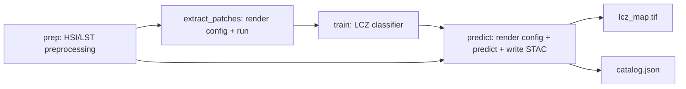

# heatwise-lcz-pipeline

Self-contained EOAP workflow package chaining the three HEATWISE processors
into a single CWL `Workflow`, end to end:

```text
heatwise-hsi-lst-prep -> heatwise-patch-extraction -> heatwise-lcz-classification train -> heatwise-lcz-classification predict
```

The final step also writes a STAC catalog and item describing the final LCZ
map and training metrics.

## Relationship To Processor Repos

The three processors remain independent repositories with their own code,
Dockerfiles and CWL files; they are not modified by anything here. This repo
consumes them only through Docker images.

- `prep` and `train` run vendored copies of the upstream CWL files:
  [tools/hsi_lst_prep.cwl](tools/hsi_lst_prep.cwl) and
  [tools/lcz_train.cwl](tools/lcz_train.cwl). The processor code lives in
  the images, so the CWL package has no `../sibling-repo/` runtime
  dependency.
- `extract_patches` and `predict` run merged glue+run CommandLineTools. Their
  glue scripts are baked into thin derived images built from [docker/](docker/).

Docker references are written in release shape and pinned to versioned tags
under `ghcr.io/heatwise-lcz/...`. Before the images are published, build and tag
them locally with the same names. After publication, the same CWL files can
run elsewhere by pulling those exact tags.

## Why Merged Glue Steps Exist

`heatwise-patch-extraction` and `heatwise-lcz-classification predict` take a
`config.yaml` whose contents reference staged file paths. Plain CWL step
connections pass files and directories, but they do not rewrite YAML content.

The first design rendered a config in one CWL step and consumed it in the
next. That failed because each CWL step has its own container staging paths.
The current tools render the config and run the processor inside the same
container invocation:

- [tools/extract_patches_pipeline.cwl](tools/extract_patches_pipeline.cwl)
  calls `/app/run_patch_extraction.py`.
- [tools/predict_pipeline.cwl](tools/predict_pipeline.cwl) calls
  `/app/run_predict.py` and writes the final STAC output.

The derived images are needed because the upstream images use
`ENTRYPOINT ["python", "/app/processor.py"]`; Docker appends arguments to a
fixed entrypoint instead of replacing it. The derived images clear
`ENTRYPOINT`, add the glue script, and otherwise layer on top of the verified
processor image.

## Repository Structure

```text
heatwise-lcz-pipeline/
|-- heatwise_pipeline.cwl
|-- tools/
|   |-- hsi_lst_prep.cwl
|   |-- lcz_train.cwl
|   |-- extract_patches_pipeline.cwl
|   |-- predict_pipeline.cwl
|-- scripts/
|   |-- run_patch_extraction.py
|   |-- run_predict.py
|-- docker/
|   |-- patch-extraction-pipeline.Dockerfile
|   |-- lcz-classification-pipeline.Dockerfile
|-- examples/
|   |-- job.yaml
|   |-- run_local.sh
|   |-- run_all_config_docker.yaml
|   |-- prep_catalog_docker.json
|   |-- patch_config_template.yaml
|   |-- predict_config_template.yaml
|   |-- train_config_sample.yaml
|-- data/
|   |-- Berlin_S2.tif
|   |-- Berlin_labels/
|-- README.md
|-- LICENSE
|-- requirements.txt
```

## Workflow



## Build

Until the images are published to a registry, build all images locally using
the same versioned names that the CWL files reference. This keeps local tests
aligned with the eventual delivery tags:

```bash
# From the three processor repos
docker build -t ghcr.io/heatwise-lcz/heatwise-hsi-lst-prep:0.1.1 ../heatwise-hsi-lst-prep
docker build -t ghcr.io/heatwise-lcz/heatwise-patch-extraction:0.1.0 ../heatwise-patch-extraction
docker build -t ghcr.io/heatwise-lcz/heatwise-lcz-classification:0.1.0 ../heatwise-lcz-classification

# From this repo root
docker build -f docker/patch-extraction-pipeline.Dockerfile -t ghcr.io/heatwise-lcz/heatwise-patch-extraction-pipeline:0.1.0 .
docker build -f docker/lcz-classification-pipeline.Dockerfile -t ghcr.io/heatwise-lcz/heatwise-lcz-classification-pipeline:0.1.0 .
```

Rebuild the derived images whenever [scripts/run_patch_extraction.py](scripts/run_patch_extraction.py)
or [scripts/run_predict.py](scripts/run_predict.py) changes; the containers
run the baked-in copies.

For registry delivery, push the same five tags after they have been tested
locally. No CWL file changes should be needed after the push.

## Run CWL

```bash
cwltool --outdir cwl_output heatwise_pipeline.cwl examples/job.yaml
```

[examples/job.yaml](examples/job.yaml) is self-contained: sample data are
under [data/](data/), and configs/templates are under [examples/](examples/).

Workflow outputs copied to `--outdir`:

| Output | Content |
|---|---|
| `lcz_map` | Final LCZ classification GeoTIFF |
| `stac_catalog` | Root STAC catalog for final products |
| `predict_output/` | LCZ map, metric CSV copies, STAC catalog and item |
| `prep_output/` | HSI/LST prep outputs and prep STAC |
| `patch_h5` | Extracted training patches |
| `train_output/` | Checkpoints, confusion matrices and summary.csv |

## Run Locally Without Docker/CWL

This is the local Python test level of the EOAP guideline. Only `pyyaml` is
needed for the glue scripts (`pip install -r requirements.txt`); the three
processor repos must be checked out and have their own environments installed.
Adjust the `../heatwise-*` paths if your checkout layout differs.

All four steps are wrapped in [examples/run_local.sh](examples/run_local.sh)
(`bash examples/run_local.sh`; override repo locations via
`PREP_REPO`/`PATCH_REPO`/`LCZ_REPO`). The individual commands:

```bash
python ../heatwise-hsi-lst-prep/processor.py run-all \
    --config ../heatwise-hsi-lst-prep/examples/run_all_config.yaml \
    --input-catalog ../heatwise-hsi-lst-prep/examples/stac_input/catalog.json \
    --output-dir output/prep

python scripts/run_patch_extraction.py \
    --template examples/patch_config_template.yaml \
    --prep-dir output/prep \
    --sentinel2 data/Berlin_S2.tif \
    --labels-dir data/Berlin_labels \
    --labels-basename Berlin_labels \
    --output-h5 output/patches.h5 \
    --rendered-config output/patch_config_rendered.yaml \
    --processor ../heatwise-patch-extraction/processor.py

python ../heatwise-lcz-classification/processor.py train \
    --h5-dir output/patches.h5 \
    --config examples/train_config_sample.yaml \
    --output-dir output/train

python scripts/run_predict.py \
    --template examples/predict_config_template.yaml \
    --prep-dir output/prep \
    --sentinel2 data/Berlin_S2.tif \
    --train-dir output/train \
    --experiment-name HSI-BS \
    --output-dir output/predict \
    --rendered-config output/predict_config_rendered.yaml \
    --processor ../heatwise-lcz-classification/processor.py
```

## Status

- The full Python chain has been verified locally with real intermediate
  outputs and produced a valid LCZ map.
- The restructured CWL workflow has passed an end-to-end `cwltool` run on
  2026-07-09 with `Final process status is success`.
- Native Windows `cwltool` may need local guards for Unix-only APIs in recent
  versions. WSL2 is the recommended route for repeatable CWL execution.
- Still pending for full EOAP delivery: test on an EOAP/APEx-compatible
  platform. The five Docker images are published on GHCR under
  `ghcr.io/heatwise-lcz/` with pinned version tags.
